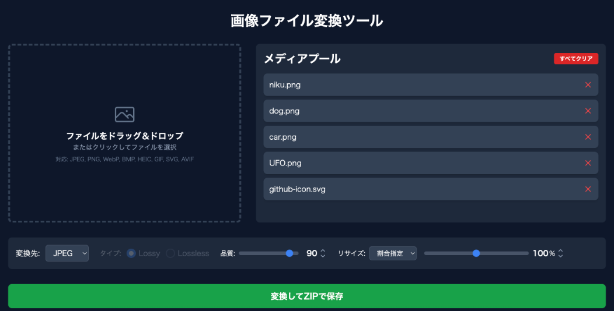

# [Image Converter]

## Recommended Environment
This tool is designed for use on a PC with the Google Chrome browser. Operation on other devices or browsers is not guaranteed.

## 推奨環境
このツールは、PC上のGoogle Chromeブラウザでの使用を想定しています。他のデバイスやブラウザでの動作は保証されていません。

## Demo
You can try this tool on the page below.

https://black-sesame-ice-cream.github.io/image-converter/

## デモ
以下のページでこのツールを試すことができます。

https://black-sesame-ice-cream.github.io/image-converter/

## Overview
This is a web-based tool for converting image file formats. It runs entirely in the browser (client-side) and does not upload files to a server.

It supports various input formats (JPEG, PNG, WebP, BMP, HEIC, GIF, SVG, AVIF) and converts them to the selected output format (JPEG, PNG, WebP, BMP, AVIF). Options for quality and resizing are available, and the converted files are downloaded together as a single ZIP file.

*Note: The primary purpose of this tool is format conversion. While quality options are available for some formats, it may not be optimized for maximum file size reduction.*

## 概要
画像ファイル形式を変換するためのWebツールです。すべての処理はブラウザ（クライアントサイド）で完結し、サーバーにファイルがアップロードされることはありません。

様々な入力形式（JPEG, PNG, WebP, BMP, HEIC, GIF, SVG, AVIF）に対応し、選択した出力形式（JPEG, PNG, WebP, BMP, AVIF）に変換します。品質やリサイズのオプションも利用でき、変換後のファイルはZIPファイルとして一括でダウンロードされます。

※注意: このツールの主目的は形式の変換です。一部の形式では品質オプションが利用可能ですが、ファイルサイズの削減に最適化されていない場合があります。

## Usage
1.  Drag and drop image files onto the drop zone, or click the zone to select files.
    - Supported inputs: JPEG, PNG, WebP, BMP, HEIC, GIF, SVG, AVIF
2.  Files are added to the "Media Pool." HEIC/HEIF files are automatically processed upon addition.
3.  From the "Convert to:" (変換先) dropdown, select the desired output format.
    - Supported outputs: JPEG, PNG, WebP, BMP, AVIF
4.  AAdjust the conversion options as needed:
    - Quality (品質):
    - - Adjust the slider. This is available for JPEG, AVIF, and Lossy WebP.
    - Resize (リサイズ):
    - - Select a mode: "Percent" (割合指定) or "Pixel" (寸法指定).
    - - Percent: Adjust the slider to scale the image (e.g., 50%).
    - - Pixel: Enter the exact target "Width" (幅) and "Height" (高さ). 
5.  Click the "Convert and Save as ZIP" (変換してZIPで保存) button.
6.  A ZIP file containing all converted images will be downloaded.

## 使い方
1.  ファイルをドラッグ＆ドロップするか、クリックしてファイルを選択します。
    - 対応入力形式: JPEG, PNG, WebP, BMP, HEIC, GIF, SVG, AVIF
2.  ファイルが「メディアプール」に追加されます。HEIC/HEIFファイルは追加時に自動的に処理されます。
3.  「変換先」ドロップダウンから、希望する出力形式を選択します。
    - 対応出力形式: JPEG, PNG, WebP, BMP, AVIF
4.  必要に応じて変換オプションを調整します。
    - 品質 (Quality):
    - - スライダーで調整します。JPEG, AVIF, WebP(Lossy) で利用可能です。
    - リサイズ (Resize):
    - - 「割合指定」または「寸法指定」のモードを選択します。
    - - 割合指定: スライダーで画像の拡大・縮小率（例: 50%）を指定します。
    - - 寸法指定: 「幅」と「高さ」に直接ピクセル値を入力します。
5.  「変換してZIPで保存」ボタンをクリックします。
6.  変換されたすべての画像を含むZIPファイルがダウンロードされます。

## Licenses
Please see below for details.

[License](LICENSE/)

[Third-Party Licenses](THIRD-PARTY-LICENSES.txt/)

## ライセンス
以下を参照してください。

[ライセンス](LICENSE/)

[第三者ライセンス](THIRD-PARTY-LICENSES.txt/)

## Tech Stack
This tool is built using the following technologies:
- HTML5
- Tailwind CSS (for styling)
- JavaScript (ES6+)
- **JSZip** (for creating ZIP files)
- **UPNG.js** (for PNG encoding)
- **pako** (dependency for UPNG.js, for compression)
- **heic2any** (for HEIC/HEIF conversion)